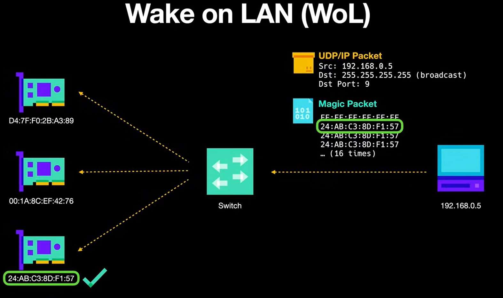

### **1. Introduction**
 ---
- Aim : Introducing a power on button to HPC.
- It will help to turn on and off the HPC.
- Objectives : Hardware Design, Network Configuration, WOL (Wake On LAN) 
  

 ### **2. Methodology**
 ---
1. How to connect a power button to motherboard?
    - Finding apporpraiate power button (momentary switch)
    - Finding the header for power button in motherboard (Front panel connector)
    - Configure BIOS setting ( In power management setting)

2. How to connect compute nodes and head node to enable the power buttons? (Hardware Design)
    - Needed components : Switch with maximum 11 ports (1 for header node and 10 for compute node) and ethernet cable (11 is enough)
    - Have to crimple ethernet cables following CAT 5E standards
    - Building appopriate node connections and power in motherboard
    - Network Configuration (Done through hard coded or DHCP)
    - Verfify the connections (Using ping command)
    - Mostly, in compute nodes don't need the front panel connection for button expect if want to reset 

3. How to enable power on button between head node and compute nodes? (Software design)
    - Enabling WOL (Wake On LAN) software package
    - Install WOL package
    - Get MAC address           (Same to what we are doing in network booting)
    - Send WOL packets to compute nodes
  

 ### **3. Implementation**

**Power Management**:

   Following a thorough examination of individual components, research has been conducted to determine the optimal power distribution among them. Initially, the plan was to utilize two 750W Power Supply Units (PSUs). However, due to technical malfunctions in one of the PSUs, the decision has been made to employ smaller PSUs for each motherboard separately. The power consumption of each hardware component is provided below for reference.
  
   |      Components        |     Power Consumption (approx)       |       Description        |
   |------------------------|-----------------------------|--------------------------|
   |Asus CS-B Intel Core i3 4th Gen | 25W - 40W       | CPU Power Management can be handeled directly from BIOS. It provides subitems that allows to manipulate the CPU ratio and feature.|
   |SAMSUNG V-NAND 500GB SSD| 3W (Active), 50mW (idle)|Each Motherboard will be connected to one of this SSD which can be powered by a same PSU.|  
   |NVIDIA QUADRO           |    45W (Max.)           |Only one of the GPU will be used in the entire system which will be connected to the head node. |        

   |Power Supply Unit (PSU)| Capacity | Description|
   |---|---|---|
   |FSP220-50LC|220W (total output) | This PSU has a maximum wattage of 60W. And the sum of the power requirements for all the components connected to the PSU should not exceed 220W. |

* Active Power Consumption:

        CPU: 25W - 40W
        SSD: 3W
        GPU: 45W
        Total Active Power Consumption = CPU + SSD + GPU
        = (25W - 40W) + 3W + 45W
        = 73W - 88W

* Idle Power Consumption (Assuming SSD and GPU are in idle state):

        SSD: 50mW (0.05W)
        Total Idle Power Consumption = CPU + SSD (Idle)
        = (25W - 40W) + 0.05W
        = 25.05W - 40.05W

* Power Supply Unit (PSU) Capacity:

        Total Output Capacity: 220W
        Maximum Wattage: 60W

* Conclusion:

    The single PSU in our system will be connected to one motherboard, one SSD, and one graphics card. The total power consumption of the system should not exceed the PSU capacity.
    
    The system is expected to consume between 73W - 88W during active use and between 25.05W - 40.05W when idle. Although a single 220W PSU could theoretically handle the load for two motherboards, practical constraints like cable and port limitations restrict each PSU to power only one motherboard in our setup

   
# How to Create Machine Learning for Predict Crypto Currencies

## Step 1: Get infomartion from API
The Alpha Vanatge API is going to be used to retrieve historical information from their database. The data will be imported in JSON format. Features to predict prices should be defined; some of them could include price, volume, and corresponding timestamps.

## Step 2: Processing Data
After obtaining the information, it is possible to use panda libraries to convert the data to numeric or date formats. Using these data, technical indicators can be calculated . It is important to fill missing values with zeros and scale the data to ensure that it is on the same scale.

## Step 3: Define Techninal Indicators 
The technical indicators RSI, EMA, and SMA are commonly employed in financial analysis to comprehend market dynamics and generate trading signals. Integrating these indicators into the ML model will assist in identifying complex patterns. Additionally, the inclusion of further technical indicators could enhance the model's analytical capabilities.

### SMA
The Simple Moving Average (SMA) calculates the average price of a security or asset over a specified period. It is derived by summing up the prices for a given number of periods and dividing the total by the same number of periods. This indicator can be instrumental in identifying both short-term and long-term trends in the data.

Where *N* is the number of periods used in the calculation, *Pi* denotes the price of the asset at period *i*.

### EMA 
The Exponential Moving Average (EMA) is a type of moving average that assigns greater significance to recent price data. Its calculation involves two primary components: the smoothing factor and the previous EMA value. The smoothing factor determines the weightage allocated to the most recent data point and is usually derived from a specified time period or number of data points. Due to its focus on recent data, the EMA responds more rapidly to price changes in comparison to the Simple Moving Average (SMA).

### RSI
The Relative Strength Index (RSI) evaluates the strength of price movements in financial assets. Typically, it is calculated by averaging gains and losses on an item over a specified time frame. The RSI can predict changes in momentum or impulse and signal potential trend reversals. Traders and analysts utilize the RSI to identify probable overbought or oversold conditions in an asset, as well as to anticipate potential price corrections or reversals.

Now the data set is ready with 6 features (Time, Price, Volume, SMA, EMA, RSI)

## Step 4: Split the data

The data should be split into training, validation, and testing sets with proportions of 70%, 10%, and 20%, respectively. The validation set is utilized to fine-tune the hyperparameters of the model and is considered part of the training process. The model solely evaluates this data but does not learn from it, ensuring an objective and unbiased evaluation of the model's performance.

## Step 5: Choosign ML model (proposals)
### Random Forest Algorithm:

The Random Forest Algorithm is commonly used for regression and classification problems. This technique entails creating a forest of decision trees, where each tree is trained on a different subset of the dataset using a distinct set of parameters. This approach aims to enhance diversity and mitigate overfitting.

After each tree has been constructed, the algorithm predicts the class or regression value by aggregating the results of each tree. In classification tasks, the forest produces the mode of the predicted classes from each tree, while in regression tasks, it produces the mean of the predictions.

A notable feature of Random Forest is its capability to perform feature selection and analyze feature importance. This is beneficial for identifying which input features are most relevant for predicting cryptocurrency prices.

To make predictions at a new point *x* , the following equation is used:

*f_Jrf(x)*  represents the predicted value of the target variable for a given input variable *x*, *J* represents the number of decision trees in the forest, *T_j(x)* represents each decision tree in the forest.

### Gradient Boosting Algorithm
The ML method belongs to the ensemble approach family, which integrates several models to produce predictions that are more accurate than those of a single model. In simpler terms, it assembles a group of less effective learners, such as decision trees, and trains them to decrease the errors of the previous model.

The residual error is utilized to train the subsequent decision tree. This process is repeated until the error is minimized. As each iteration aims to reduce errors, it also helps mitigate overfitting. Gradient Boosting (GB) can be applied to both classification and regression tasks.

One of the benefits of Gradient Boosting is its effectiveness in handling missing data and outliers. This characteristic is particularly advantageous in cryptocurrency markets, where data may be scarce and unreliable.

### Long Short-Term Memory (most recommended, it’s seems is the more accurate for our task)

The RNN (Recurrent Neural Network) architecture, particularly Long Short-Term Memory (LSTM), is adept at capturing long-term dependencies in data sequences. LSTM employs a memory cell to store and retrieve input from earlier time steps, making it well-suited for modeling sequential data with long-term dependencies. It comprises four main components: three gates (Input, Output, and Forget gates) and a memory cell.

- The input gate governs the entry of fresh inputs into the memory cell.
- The forget gate determines how much of the previous memory state should be forgotten by the memory cell.
- The output gate regulates the output of memory cell states.
- The memory cell retains and transmits data to the next time step.

To predict future prices, LSTMs can analyze historical price data to identify patterns. The model utilizes a sequence of historical prices to forecast subsequent prices. The loss function calculates the disparity between predicted and actual prices, and optimization techniques are applied to train the LSTM model effectively.

The training process is described by:

Where *x_t*  is the input at time step  *t* ,  *h_t*  is the hidden state at time  *t* , *c_t*  is the cell state at time step  *t* , and *i_t* ,  *f_t*, and  *o_t*  are the input gate, forget gate, and output gate, respectively, at time step *t* .  *W*  and  *b* are the weight matrices and bias vectors, respectively. The sigmoid function and the hyperbolic tangent function *tanh* are used to bound the output between 0 and 1, and between -1 and 1, respectively.

### Gated Recurrent Unit (GRU)
RNN architecture is also used in sequential data analysis applications, such as price predictions. It processes sequential data by maintaining an internal state that is altered whenever new input is added to the sequence.
In order to predict price trends in the crypto market, it is necessary to capture long-term dependencies and patterns in the time series data. The hidden state at time *t*, *h_t*, is updated based on the input at time *t*, *x_t*, and the previous hidden state, *h_t-1*, using the following equations:

## Step 6: Evaluation Metrics
Evaluation metrics can be utilised for comparing algorithms and determining which features in the dataset have the most significant impact on the predictions of each model.
### RMSE
Mean Squared Error (MSE) is a commonly used metric to evaluate the performance of a predictive model, particularly in regression analysis. It quantifies the disparity between the predicted and actual values of a dataset, offering a measure of the average deviation of predictions from actual values.

Where, *n* is the number of data points in the dataset, *predicted_i* is the predicted value for the i-th data point, *actual_i* is the actual value for the i-th data point.
### MAE 
Mean Absolute Error (MAE) is a commonly used metric for evaluating the accuracy of a predictive model. It calculates the average magnitude of errors in a set of predictions, without considering their direction.

Where, *Y_i* is the actual value,  *Y*^_i is the predicted value and *n* the number of observations.

### MSE
Mean Squared Error (MSE) is a commonly used metric to measure the disparity between the predicted and actual values in a regression problem. It is calculated by averaging the squared differences between the predicted and actual values. A lower MSE value indicates better performance

Where, *Y_i* is the actual value,  *Y*^_i is the predicted value and *n* the number of observations.

### R-Squared

R-squared (R2) is a statistical measure that represents the proportion of the variance in the dependent variable that is predictable from the independent variable(s). In other words, it measures how well the independent variables explain the variability of the dependent variable. R-squared values range from 0 to 1, with higher values indicating a better fit of the model to the data.

The formula to clacalute R-Squared is: 

Where,

 SSR (Sum of Squared Residuals) is the sum of the squared differences between the
 predicted values and the actual values.
 SST (Total Sum of Squares) is the sum of the squared differences between the actual values and the mean of the target variable.

### TWAP
 Time-Weighted Average Price or TWAP is a metric used to measure the averag e price of an asset over a specif period of time.
The formula to calculte TWAP is:

Where,
*Price 1* to *Price n* represent the prices recorded for each time interval, while *Time 1* to *Time n* denote the durations of each time interval. Total *time* is the sum of the durations of all time intervals

### VWAP
VWAP stands for Volume-Weighted Average Price. It's a trading benchmark used primarily by institutional traders to measure the average price a stock has traded at throughout the trading day, based on both volume and price. VWAP is calculated by dividing the total value of all trades by the total volume traded over a specific time horizon, typically the entire trading day.

The formula for VWAP is as follows:

Where:
-  *Price_i*  is the price of the asset at time  *i* .
-  *Volume_i* is the volume of the asset traded at time  *i* .
-  *n*  is the total number of time intervals or data points considered.

## Step 7: Create Prediction Model
RF and GB models can be created using the scikit-learn library. The LSTM model is constructed using the Keras library by invoking the Sequential() function and incorporating the LSTM units. The GRU model is built using the Keras library by employing the Sequential() function and adding the GRU units.

## Step 8: Selct Hypeparameters
Hyperparameters aid in fine-tuning machine learning models to fit well with unseen data and enhance performance. Hyperparameter tuning is accomplished with the assistance of a validation dataset.
### Random Forest
1. Number of trees: The Random Forest Regressor has a hyperparameter called n_estimators, which specifies the number of decision trees that compose the forest. More trees increase the risk of overfitting but also enhace the model's conpelixity. 
2. Maximum Depth of Trees (max_depth): The tree depth parameter controls the maximum depth of each tree in the ensemble. Deeper trees can capture more intricate patterns but may increase the risk of overfitting.
3. Minimum Samples for a Split: This parameter determines the minimum number of samples needed to split an internal node. A higher value can mitigate the risk of overfitting by ensuring that nodes with insufficient samples are not split."

### GB
1. Number of Trees (n_estimators): This hyperparameter specifies the number of decision trees to be built in the random forest. Increasing the number of trees generally improves the performance of the model, up to a certain point where further increases may not result in significant improvements but increase computational cost.

2. Maximum Depth of Trees (max_depth): This hyperparameter controls the maximum depth of each decision tree in the random forest. Deeper trees can capture more complex relationships in the data but are more prone to overfitting. Setting an appropriate max_depth helps balance between model complexity and overfitting.

3. Number of Features Considered for Split (max_features): This hyperparameter determines the maximum number of features to consider when looking for the best split at each node of the decision tree. It can be specified as an integer (considering a fixed number of features) or as a fraction (considering a fraction of total features). Choosing a lower value reduces the correlation between trees and helps improve the diversity of the ensemble, which can lead to better generalization performance.

### LSTM
1. Number of LSTM Units (units): This hyperparameter determines the number of memory cells or units in the LSTM layer. More units can help the model learn more complex patterns in the data, but it also increases the computational cost and the risk of overfitting.

2. Dropout Rate (dropout): Dropout is a regularization technique used to prevent overfitting in neural networks. It randomly drops a proportion of the units (neurons) in the LSTM layer during training. The dropout rate hyperparameter controls the probability of dropping a unit. A common value for dropout rate is between 0.2 and 0.5.

3. Sequence Length (input_length): In a sequence-to-sequence model like LSTM, the sequence length represents the length of input sequences fed into the network. It's important to choose an appropriate sequence length based on the nature of the problem and the characteristics of the data. A longer sequence length allows the model to capture more temporal dependencies but requires more memory and computational resources.

### GRU 
1. Number of Units (units): This hyperparameter determines the dimensionality of the hidden state and the output of the GRU cell. More units allow the model to capture more complex patterns in the data but increase computational cost. The number of units is a key factor in determining the capacity of the model to learn from sequential data.

2. Dropout Rate (dropout): Dropout is a regularization technique used to prevent overfitting in neural networks. It randomly drops a proportion of the units (neurons) in the GRU layer during training. The dropout rate hyperparameter controls the probability of dropping a unit. A common value for dropout rate is between 0.2 and 0.5.

3. Activation Function (activation): This hyperparameter specifies the activation function used in the GRU cell. The most common activation functions for GRU cells are 'tanh' (hyperbolic tangent) for the update and reset gates, and 'sigmoid' for the candidate activations. However, depending on the problem and data, other activation functions like ReLU (Rectified Linear Unit) may also be used.

## Step 9: Training Model
Modesl are tained using the trainiog dataset and setting the hyper-parameters to the value found during validation.

## Step 10: Testing the model 
Testing assesses the performance of the ML model using a separate testing dataset. This dataset is created by splitting the original dataset, ensuring that the models are evaluated on data they haven't been trained on. Usually a the Ml model has got a predict() function for make a prediction.

## Step 11: Evaluation Metrics
Evaluation metrics are crucial for assessing a model's performance and its suitability for addressing a specific problem. When comparing multiple machine learning models, analyzing metric values helps in selecting the most effective model.

## Helpful Resources
1. https://www.diva-portal.org/smash/get/diva2:1778251/FULLTEXT03
2. https://www.sharpsightlabs.com/blog/machine-learning-hyperparameters-explained/
3. https://scikit-learn.org/stable/index.html
4. https://www.warse.org/IJATCSE/static/pdf/file/ijatcse351942020.pdf

 ### **4. Helpful Resources**
 ---
1. The button can be find here: https://uk.rs-online.com/web/p/push-button-switches/2099127?cm_mmc=UK-PLA-DS3A-_-google-_-CSS_UK_EN_PMAX_RS+PRO-_--_-2099127&matchtype=&&gad_source=1&gclid=EAIaIQobChMIpP3xg7-mhAMVFAUGAB0t5QD5EAQYByABEgIy1_D_BwE&gclsrc=aw.ds

2. How to install WOL : https://pimylifeup.com/ubuntu-enable-wake-on-lan/#:~:text=Wake%2Don%2DLAN%20is%20a,functionality%20through%20your%20devices%20BIOS.

3. Power button and Front panel connections : https://www.pcinq.com/how-to-connect-motherboard-front-panel-headers/
                            https://www.electronicshub.org/power-button-on-motherboard/#:~:text=Ans%3A%20The%20power%20switch%20on,for%20the%2020-pin%20header
  

## Authors

 ### **5. Images**
 ---
 
<b>Figure 1:Push button to be used in the HPC</b>
  

 
<b>Figure 2:Wake On LAN</b>
 

