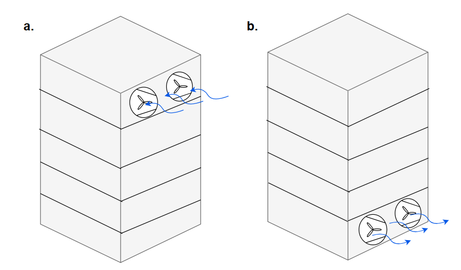
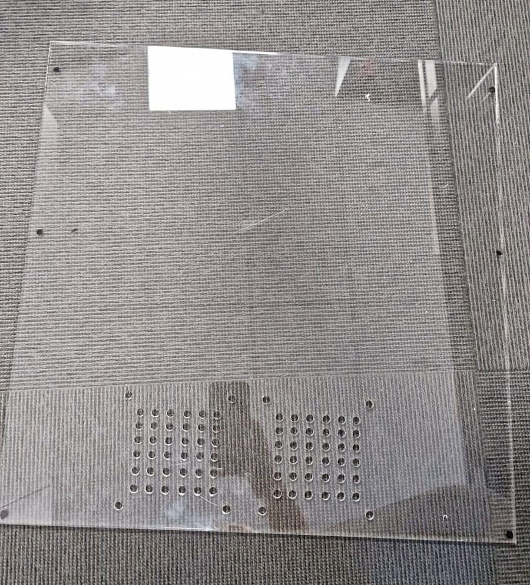

<h1 align="center">High-Performance Computing System</h1>

## Table Of Contents
- [I. About The Project](#i-about-the-project)
- [II. Built With](#ii-built-with)
- [III. Introduction](#iii-introduction)
- [1. System Design And Architecture](#1-system-design-and-architecture)
- [2. Technology Research:](#2-technology-research)
  - [2.1 Operating System Selection:](#21-operating-system-selection)
    - [2.1.1 Install Operating System in Head Node](#211-install-operating-system-in-head-node)
    - [2.1.2 Install Operating System in Compute Node](#212-install-operating-system-in-compute-node)
  - [2.2 Power Management](#22-power-management)
  - [2.3 Network Interconnect:](#23-network-interconnect)
  - [2.4 Cooling Calculations](#24-cooling-calculations)
    - [2.4.1.	3D Model](#2413d-model)
- [3. System Construction:](#3-system-construction)
- [4. Housing and Cooling Solutions:](#4-housing-and-cooling-solutions)
  - [4.1. Original Design For The HPC Case](#41-original-design-for-the-hpc-case)
  - [4.2. Problems Encountered](#42-problems-encountered)
  - [4.3. Chosen Shell](#43-chosen-shell)
  - [4.4. Other alterations](#44-other-alterations)
  - [4.5 Design reflection and future improvements](#45-design-reflection-and-future-improvements)
  - [4.6. Time impairment](#46-time-impairment)
  - [4.7.  Material acquisition](#47--material-acquisition)
  - [4.8. Ventilation](#48-ventilation)
  - [4.9. Change in requirements](#49-change-in-requirements)
  - [4.10 Reflection](#410-reflection)
- [5. System Configuration](#5-system-configuration)
  - [5.1. Networking](#51-networking)
    - [5.1.1. Open-SSH connection](#511-open-ssh-connection)
    - [5.1.2 Network File System (NFS)](#512-network-file-system-nfs)
  - [5.2. Power on and off function in HPC](#52-power-on-and-off-function-in-hpc)
  - [5.3. CPU frequency scaling](#53-cpu-frequency-scaling)
  - [5.4 CPU Overclocking](#54-cpu-overclocking)
- [6.Software Installation](#6software-installation)
  - [6.1. PXE Server Configuration on Ubuntu](#61-pxe-server-configuration-on-ubuntu)
  - [6.2. Cluster Package Management Script](#62-cluster-package-management-script)
    - [6.2.1. Setup](#621-setup)
    - [6.2.2. Usage](#622-usage)
  - [6.3. SLURM Configuration](#63-slurm-configuration)
  - [6.4. Apptainer Configuration](#64-apptainer-configuration)
  - [6.4.1. Reasons for Using Apptainer](#641-reasons-for-using-apptainer)
  - [6.5. Configure Prometheus and Grafana](#65-configure-prometheus-and-grafana)
  - [Importance of Grafana and Prometheus in HPC Context](#importance-of-grafana-and-prometheus-in-hpc-context)
  - [6.6. Monitoring Energy Consumption and Efficiency with Prometheus](#66-monitoring-energy-consumption-and-efficiency-with-prometheus)
- [7. Task Implementation:](#7-task-implementation)
  - [7.1. How to Create Machine Learning for Predict Crypto Currencies](#71-how-to-create-machine-learning-for-predict-crypto-currencies)
  - [7.2. Implementation of Cryptocurrency Price Prediction Application](#72-implementation-of-cryptocurrency-price-prediction-application)
- [8. Performance Evaluation: Develop a strategy for evaluating HPC system performance.](#8-performance-evaluation-develop-a-strategy-for-evaluating-hpc-system-performance)
- [9. Software and OS Maintenance:](#9-software-and-os-maintenance)
  - [9.1. The Critical Role of Software and OS Maintenance](#91-the-critical-role-of-software-and-os-maintenance)
    - [9.1.1. Software Maintenance for Enhanced Performance and Reliability:](#911-software-maintenance-for-enhanced-performance-and-reliability)
    - [9.1.2. OS Maintenance for Stability and Security:](#912-os-maintenance-for-stability-and-security)
    - [9.1.3. Impact of Maintenance on Software Complexity and Maintenance Performance:](#913-impact-of-maintenance-on-software-complexity-and-maintenance-performance)
  - [9.2. Setting Up a System for Software and Operating System Updates Using Cron and Git](#92-setting-up-a-system-for-software-and-operating-system-updates-using-cron-and-git)
  - [9.3. Create Man Page](#93-create-man-page)
- [10. Conclusion](#10-conclusion)
- [IV. References](#iv-references)
- [V. Authors](#v-authors)
  
  
# I. About The Project
The provided documentation outlines the comprehensive process undertaken by Team 0 for the design of a High Performance Computing (HPC) system as part of the Advanced Computer Engineering Module for the Computer Engineering Program at the University of Greenwich for the academic year 2023/24. This report guides the reader through a detailed step-by-step procedure encompassing both hardware and software aspects of the project. By following this documentation, readers will gain insights into the systematic approach employed by the team, enabling them to replicate and create their own HPC systems.  

The video documentation link can be found [here](https://www.youtube.com/watch?v=lD17i18koeo)

# II. Built With
- [Ubuntu](https://ubuntu.com/)
- [OpenSSH Server](https://ubuntu.com/server/docs/service-openssh)
- [Netwrok File Storage](https://ubuntu.com/server/docs/service-nfs#:~:text=NFS%20allows%20a%20system%20to,if%20they%20were%20local%20files.)
- [Slurm](https://slurm.schedmd.com/documentation.html)
- [Apptainer](https://apptainer.org/)
- [Grafana](https://grafana.com/)
- [Prometheus](https://prometheus.io/)
- [Python](https://www.python.org/)
- [Keras](https://keras.io/)
- [Scikit-learn](https://scikit-learn.org/stable/)
- [Pandas](https://pandas.pydata.org/)
- [Numpy](https://numpy.org/)
- [Yahoo Finance](https://finance.yahoo.com/quote/ORGN/?guccounter=1&guce_referrer=aHR0cHM6Ly93d3cuZ29vZ2xlLmNvbS8&guce_referrer_sig=AQAAAMMlh1WRJFSvhLwklRkllY4pF1bpIJDdzQW2RgzNQdXT9UneK7NrRyRfjRJjhlIqbXDo1fI8VZPe85jaJblPOzyxqJAUwbFIsEzwMxvuVRmiYa3RKBUCLKCt_m06g9hC8rNy5_lFaXcNjSt4hr4b0dFH7SEKdNbcdpUGrOiApW0R)
  

# III. Introduction

HPC (High Performance Computing) involves combining the computational capabilities of multiple computers to achieve significantly greater performance than individual systems. It can be referred as Cluster Computing, where a network of two or more computing devices collaborates towards a shared computing objective. This network operates on the principle of parallel processing, which entails distributing complex tasks among two or more processors (CPUs) to expedite their execution.

This documentation outlines the procedures undertaken to construct a comprehensive HPC system utilizing five motherboards, with one serving as the head node and four as compute nodes. The HPC is intended to run a cryptocurrency prediction application capable of forecasting Bitcoin, Ethereum, and Binance Coin (BNB) prices using its datasets. Additionally, it provides a detailed, step-by-step guide for configuring services and necessary configuration files to facilitate parallel processing and establish connections between nodes.

# 1. System Design And Architecture 

Before commencing the project design process, a comprehensive file containing all specifications was compiled. This file proved invaluable throughout the project, aiding in power and cooling calculations and enhancing our understanding of the system. [Specification of all the components can be found here!](hardware.md)

Initially, a design concept was developed, featuring two cases where motherboards were stacked vertically, each housing five motherboards. These motherboards would be powered by a 750W Power Supply Unit (PSU). Additionally, this design would be connected to a Single Board Computer (SBC), serving as the head node. Figure 1 illustrates the initial design idea.

<div align="center">

<br>
      <b>Figure 1: Initial Design Sketch</b>
      <br>

</div>

But the initial idea was dropped, as it was realised that single board computer is not required, as motherboard with a wifi adapter was powerful than a single board to work as a head node. because of the time constraint, only one case was designed with 5 motherboards, and PSU was also changed because of technical issues. Therefore the design was finalised which is similar to the initial idea but only one case with five motherboard were used and the position of fans were moved to the side  which is much efficient place which will be discussed below. The final design is depicted in figure 2.

However, the initial concept was abandoned upon the realization that a single motherboard with a Wi-Fi adapter was more powerful compared to a single board computer for serving as the head node. Due to time constraints, only one case was designed to accommodate five motherboards, and the PSU was replaced due to technical challenges. Consequently, the finalized design closely resembled the initial idea, with a single case housing five motherboards. Additionally, the positioning of fans was relocated to the side, which was deemed more efficient. The final design is depicted in Figure 2.

<div align="center">

<br>
      <b>Figure 2: Final Design Sketch</b>
      <br>

</div>

Once the basic structure of the HPC was conceptualized, technical research was initiated to gather essential information and conduct necessary calculations.

# 2. Technology Research: 

## 2.1 Operating System Selection: 

Initially, an attempt was made to determine which operating system the ASUS CS-B motherboard supports. However, the information available suggests that the ASUS CS-B is only compatible with Ubuntu 13.10, as indicated in the provided image.


Figure 3: OS Compatibility of Asus CS-B 

### 2.1.1 Install Operating System in Head Node

1. Once the operating system was determined, below steps are followed to install ubuntu desktop 13.10:
      - Downloaded the Ubuntu Desktop from the official Ubuntu website (https://old-releases.ubuntu.com/releases/13.10/). As Intel processor is used, PC (Intel x86) desktop image is chosen when downloading the image.
      - Created a bootable USB drive using Rufus.
      - Booted the motherboard from the USB drive.
      - Followed the installation wizard to install Ubuntu Desktop on the system.


                  sudo apt update                                           
            
                  sudo apt upgrade
    
- The head node serves as a central control unit in an HPC environment, orchestrating and managing the entire cluster. Its primary purposes include task scheduling, resource allocation, and overall coordination of computational tasks within the cluster. By installing      the Ubuntu Server and setting the default target to multi-user mode optimize resource allocation, conserving RAM and CPU resources by eschewing unnecessary graphical sessions. This ensures that the head node operates efficiently, enabling it to efficiently manage and    oversee the computational workload of the entire HPC cluster.
  
            To install Ubuntu Server  : sudo apt install ubuntu-server
            To disable GUI            : sudo systemctl set-default multi-user.target
     
Although the documentation states that the ASUS CS-B motherboard can only run Ubuntu 13.10, a brief test was run to see how the motherboard would react to installing Ubuntu 24.04 (Nobel Numbat), a more recent version of the operating system. The Ubuntu 24.04      
operating system ran on the system very well, with no noticeable glitches. This surprising finding prompted more investigation into the motherboard's compatibility with the latest Ubuntu versions. 
Although documentation indicates otherwise, one plausible explanation for Ubuntu 24.04's successful running on the ASUS CS-B motherboard could be the hardware compatibility enhancements included in later Ubuntu editions. The Ubuntu operating system is continuously improved and optimised by its developers throughout time to improve compatibility with a wider variety of hardware setups. Because of this, more recent versions of Ubuntu might by nature support a greater range of motherboards, including the ASUS CS-B. Moreover, improvements in system libraries, kernel updates, and device drivers in Ubuntu 24.04 can also be responsible for its smooth operation on the ASUS CS-B motherboard. These updates might take care of any compatibility problems that earlier motherboard models might have had, making it possible to use current Ubuntu editions more smoothly.

After noticing that Ubuntu 24.04 operated steadily on the ASUS CS-B motherboard, the group chose to switch from Ubuntu 13.10 to this more recent version. This choice was driven by the goal of utilising Ubuntu 24.04's most recent software features, security updates, and hardware compatibility changes to provide the best possible computing environment for the team's activities.

### 2.1.2 Install Operating System in Compute Node

The process of installing the operating system on a compute node is similar to that of the head node, with the exception that it is not required the installation of Ubuntu Server specifically.

## 2.2 Power Management

   Following a thorough examination of individual components, research has been conducted to determine the optimal power distribution among them. Initially, the plan was to utilize two 750W Power Supply Units (PSUs). However, due to technical malfunctions in one of the PSUs, the decision has been made to employ smaller PSUs for each motherboard separately. The power consumption of each hardware component is provided below for reference.
  
   |      Components        |     Power Consumption (approx)       |       Description        |
   |------------------------|-----------------------------|--------------------------|
   |Asus CS-B Intel Core i3 4th Gen | 25W - 40W       | CPU Power Management can be handeled directly from BIOS. It provides subitems that allows to manipulate the CPU ratio and feature.|
   |SAMSUNG V-NAND 500GB SSD| 3W (Active), 50mW (idle)|Each Motherboard will be connected to one of this SSD which can be powered by a same PSU.|  
   |NVIDIA QUADRO           |    45W (Max.)           |Only one of the GPU will be used in the entire system which will be connected to the head node. |        

   |Power Supply Unit (PSU)| Capacity | Description|
   |---|---|---|
   |FSP220-50LC|220W (total output) | This PSU has a maximum wattage of 60W. And the sum of the power requirements for all the components connected to the PSU should not exceed 220W. |

* Active Power Consumption:

        CPU: 25W - 40W
        SSD: 3W
        GPU: 45W
        Total Active Power Consumption = CPU + SSD + GPU
        = (25W - 40W) + 3W + 45W
        = 73W - 88W

* Idle Power Consumption (Assuming SSD and GPU are in idle state):

* Active Power Consumption:

        CPU: 25W - 40W
        SSD: 3W
        GPU: 45W
        Total Active Power Consumption = CPU + SSD + GPU
        = (25W - 40W) + 3W + 45W
        = 73W - 88W

* Idle Power Consumption (Assuming SSD and GPU are in idle state):


* Power Supply Unit (PSU) Capacity:

        Total Output Capacity: 220W
        Maximum Wattage: 60W

Therefore, a single PSU in our system will be connected to one motherboard, one SSD, and one graphics card. The total power consumption of the system should not exceed the PSU capacity.

The system is expected to consume between 73W - 88W during active use and between 25.05W - 40.05W when idle. Although a single 220W PSU could theoretically handle the load for two motherboards, practical constraints like cable and port limitations restrict each PSU to power only one motherboard in our setup

## 2.3 Network Interconnect:

There are several interconnect technologies available for establishing connection in a cluster computing with their own strength and specefic use-cases. Some of them are :

1. **Infiniband** : Computer Networking communication standard used in high-performance computing that features high throughput and very low latency. It supports Remote Direct Memory Access(RDMA), which means the ability to access host memory directly without CPU intervention. Infiniband is widely used in supercomputer clusters and it is preferred network interconnection technology for GPU servers.
2. **NVIDIA NVLink** : World's first high-speed GPU interconnect technology that can connect two graphics card , with low latency, and high bandwidth. It is ideal for the system that uses NVIDIA graphics card, such as those in deep-learning and GPU accelerated computing. It is not best option for our project,as it is only compatible with NVIDIA graphics card and we will be using intel graphics card for our HPC.
3. **Intel Omni-Path Architecture(OPA)** : OPA is communication architecture developed by intel which aims for low communication latency, low power consumption and a high throughput. It is often used for HPC application with Intel processor. OPA directly competes with infiniband.
4. **Ethernet** : Ethernet is one of the commonly used interconnect technology because of its versatility, scalability and compatibility.It migh not provide same low-latency level as specialised interconnect like infiniband but it provides various speed, ranging from 10 megabyte to 100 gigabyte per second.    

The type of interconnect technology one needs lies on what kind of system they are building and what kind of interconnect is compatible with the system. For our system, specefication and hardware is given above.

For this project, Ethernet cables will be utilized due to their accessibility and sufficient speed for project requirements. These cables will serve dual purposes: data transfer and network bridging. The motherboard provided includes two Ethernet ports, both of which will be utilized for interconnecting nodes.

The head node will establish connections with all other nodes via a switch. Two switches will be employed: one for interconnecting all nodes to facilitate data transfer, and the other to distribute internet connectivity from the head node to all compute nodes. 

By default, one of the ports is enabled. However, to activate the second port, users must adhere to the following steps:

            Reboot the motherboard 

            Press the 'F2' or 'Del' button to access the BIOS settings 

            Navigate to Advanced settings using arrow keys.

            Proceed to Network Interface Stack Setting

            Enable the Second Interface named "Retalke Interface" (most of the cases, name may vary)

            Esure that your "Intel Interface" is also enabled.

Once the steps are followed and both interfaces are activated, users can proceed to configure each interface to perform specific tasks. Detailed instructions can be found in the following link: [Configuring Interface using Nm-Connection-Editor](https://github.com/TeachingMaterial/ace-2023_-team-0/tree/documentation/nm-connection-editor-Harishanan)

Ethernet cables were manually crimped for this project, adhering to the Registered Jack 45 (RJ-45) standard. The figure 4  illustrates the color standard for RJ-45 cables..
<div align="center">

<br>
      <b>Figure 4: RJ-45 Standard</b>
      <br>
</div>

Step wise Step  process is shown in figure 5 below:
<div align="center">

<br>
      <b>Figure 5: Step by Step Ethernet Cimp</b>
      <br>
</div>

System is expected to consume between 73W - 88W during active use and between 25.05W - 40.05W when idle. Although a single 220W PSU could theoretically handle the load for two motherboards, practical constraints like cable and port limitations restrict each PSU to power only one motherboard in our setup

## 2.4 Cooling Calculations

Cooling calculations were conducted to determine the necessary airflow for ordering the appropriate fan. This involved performing a simple arithmetic calculation, the details of which can be found in the [this file here.](coolingcalculation.md). 

### 2.4.1.	3D Model 
 The selection of the fan was made with careful consideration of various factors, and a dual-fan system was chosen. Two fans are positioned at the front of the case to intake cool air, while another two are situated at the back to expel hot air as depicted in Figure 1. This configuration creates an airflow pattern that helps maintain optimal temperatures for all components.

   Additionally, the CPU fan, which is attached to the motherboard, provides active cooling for the CPU. Moreover, the GPU and power supply unit also have built-in fans for additional cooling.
  <div align ="center">

   <br>
   <b>Figure 6: 3D Model of Case with the fan where a) represents the front 3D view and b) represent the back 3D view </b>
   <br>
  </div>

# 3. System Construction:

Following the completion of all technical research, a preliminary outline for the basic system construction was created. This step was crucial to ensure that once the case was constructed, the components could be assembled in each shelf according to the designated layout. Notably, since the head node includes a GPU whereas the compute nodes do not, additional clearance was required to prevent overcrowding and ensure proper placement of the motherboard. The initial design for a shelf, which encompasses the motherboard, PSU, and SSD, is depicted in the figure 7 below.

  <div align ="center">

 <br>
   <b>Figure 7: 2D Structure of the shelf with all the components.</b>
   <br>

</div>

Each motherboard was equipped with a 500 GB SSD and 2 * 8 GB RAM, providing sufficient resources for efficient task execution. With four compute nodes in use, this configuration ensures optimal performance. Additionally, the head node can leverage the resources of all nodes simultaneously when executing tasks.

During the layout creation process, careful consideration was given to various requirements such as cooling, power supply, placement dimensions, and more. All calculations pertaining to these requirements have been documented in detail below.

# 4. Housing and Cooling Solutions: 

## 4.1. Original Design For The HPC Case
The original design for the case consisted of 3D printing of all components needed. This included the shelves, floor, roof, and side/back panels of the case. Multiple aspects have to be considered when designing the case such as the components requirements, ventilation, and accessibility. All original shelf and case piece that have been uploaded were designed to be durable and well ventilated and were easily connected together using a pin system

## 4.2. Problems Encountered
While waiting to receive the initial components from 3d printing I was informed that it would take to long to 3d print all my required components as there were many other students looking to 3d print components at this time Aswell. To solve this issue, we decided to order the shell of our case and print the brackets and laser cut the shelves as well as the front and back panels in stead of printing all the components


## 4.3. Chosen Shell  
The case we ordered was a 21U tall server racking system which was perfect for the purpose of our projects. It came with slots all down the left and ride side of the case which ensured enough ventilation for the fans to disperse the heat 

<div align="center">

<br>
<b>Figure 8:Case</b>
<br><br>

</div>

The 1U brackets were 3d printed in order to hold the acrylic shelves that were laser cut. They were mounted in the holes that were ment for the racking system of the case. An extension cord was placed at the back and mounted to the top of the case. Whis acted as a way to limit the amount of cables that would exit the case. Instead, we could power each of the motherboards power sources internally 

<div align="center">
  
<br>
<b>Figure 9:3D printed brakets </b>
<br><br>

</div>

The front and back of the case was laser cut in acrylic with 120x120 fan holes at the base and the top in order to mount the fan to then in a way that allowed them to get a strong enough air pull. Hence the small circles that fill the 120x120 frame. the back panel was made to be slightly smaller to allow room for the extension cord 

<div align="center">

<br>
<b>Figure 10:3D back panel of case  </b>
<br><br>

</div>

## 4.4. Other alterations
Rubber feet will be used on the motherboards and the SSDs to limit the directs contact onto the shelves to allow air underneath the boards when necessary. The extension cable will run down the side of the case into an outlet. The power button will drill through the roof of the case to allow Instant power to the application we have also decided to cover the back of the case to limit the light inside the case to utilize the led fans. All power supply will plug directly into the extension cord build into the case

## 4.5 Design reflection and future improvements 
During the course of this assignment there have been a few development problems and issues that arose in regard to the specific design of the case such as the time impairment, material acquisition, ventilation and change in requirements. In this report I will discuss how each of these problems were analyzed and resolved to display a design that fit the requirements of the projects while also remaining affordable and simple to construct.

## 4.6. Time impairment 
The first and possible largest issue we faced in constructing the case was time. As we had a fixed amount of time to build and submit the Hpc the case had to be completed in about a month and a half. My first idea was 3D printing the part required to build the frame/shelfing unit. After sending my designs of to be printed I was told that all part would take over 80 das as there was over 65 pieces to print along with other student needing to use the printing facilities as well.to work around this problem I decided that purchasing a frame could be cheaper and less time consuming as well as having more stability. This way I could focus more on altering the internal of the case as well as making a front and rear for the frame. This cut the time to create a case by at least a month allowing more time for alterations if need be 

## 4.7.  Material acquisition 
An issue arose with the materials as some materials were ordered before the time issues were realized. This issue was fixed by ordering the correct components and altering the lengths of some of the cables needed like the ethernet cable and the power cable along with some cable management. I mention these issues as it highlighted the need to double-check the design before ordering any components as well as communicating with my teams to avoid these mistakes happening in the future.

## 4.8. Ventilation
The ventilation of the case was considered from the very beginning as it essential to keep the system cool under prolonged periods of time.  With 5 motherboards being used in sync I decided to go with a 2 in 2 out fans system. 2 fans would take air in at the top front of the case and 2 would blow air out of the case at the bottom rear. This would allow decent air flow that would keep a steady current around the case. Temperature sensors inside the case can monitor how hot the components get and alert the user if the temperature exceeds the recommended limit.

## 4.9. Change in requirements 
Throughout the course pf this project there were a number of alterations that needed to be made to counter errors in judgement as well as new components that needed to be added to achieve complete networking between the boards. By altering the size of the shelves and by utilizing the space in the side of the case for storing the wires, all new components and power sources fit as needed 

## 4.10 Reflection 
If I were to design this case again, I believe there are a few changes that could be made. I think the biggest change I would make is I would have made holes across the laser cut shelves as it would increase the ventilation in the case however if I did this, I would make the shelf out of wood as with to many holes cut the structural integrity would be compromised and they may not be able to hold the components at the current thickness. By changing the material to wood and increasing the thickness of the shelves, adding the holes will not impair the performance. It is important to keep in mind the ultimate stress point and the fracture point of the material used as well as the elastic point. The brackets that were built were perfectly fit for purpose so I will utilize them for similar case frames in the future and if given the opportunity to improve this case


# 5. System Configuration

## 5.1. Networking
To enable parallelisation in HPC, networking must be established between the head node and compute nodes. Therefore, this section will discuss how the network is established in this project's HPC and will also discuss components such as IP address configuration, network topology, and network bridging in more detail. As an introduction, for this networking setup, a star networking topology, static IP configuration and nm-connection editor have been used and will be discussed in more detail below. Note: In the HPC, the operating system is downloaded separately on each node.

[Step by Step Configuration File Can be Found Here](nm-connection-editor.md)

Through this successful networking implementation, future works such as SLURM configuration, Wake On LAN, OpenSSH and many more can be enabled.


### 5.1.1. Open-SSH connection

OpenSSH, or Open Secure Shell, is an open-source implementation of the SSH protocol. It provides secure communication between two or more computers over an unsecured network, ensuring data exchange confidentiality and integrity. OpenSSH is widely used in Linux and other Unix-like operating systems as the standard SSH implementation for remote administration, secure file transfer, and tunnelling other network services.

In this project, Secure Shell (SSH) is employed to establish secure connections between all nodes. The OpenSSH server facilitates access from one node to another, enabling seamless communication and interaction between systems. OpenSSH is an essential component in configuring servers such as NFS and SLURM, ensuring secure and encrypted communication channels for data transfer and remote management tasks.

[Step by step configuration guide available here!](openssh.md)


### 5.1.2 Network File System (NFS)
The Network File System (NFS) is a networking protocol designed for distributed file sharing. A file system organizes and stores data in the form of files, typically on Hard Disk Drives (HDDs) or Solid-State Drives (SSDs). NFS operates on a similar principle, allowing files to be stored and accessed over a network, enabling multiple devices within the same network to retrieve and share data.

NFS is a widely utilized protocol for file sharing servers, offering compatibility across a broad spectrum of operating systems. In this project, NFS will play a crucial role in facilitating seamless file sharing among all client nodes. In this project, the functionality of NFS can be illustrated using a visualization similar to Figure 1:
<div align = "center">


<p> Figure 11. Network File Sharing </p>
</div>

In this representation:

- The "Head Node" hosts a shared directory containing files.
- The "Client Node" connects to the File Server using NFS.
- The shared directory is mounted on the Client Node, allowing  seamless access to files.
- Applications running on the Client Node can interact with the shared files through the mounted directory.

Step by Step NFS configuration Guide Can be found here: [NFS Configuration](NFS.md)
           

## 5.2. Power on and off function in HPC

Due to failures experienced with the power-on button for the entire HPC system, the strategy was changed to power the HPC on and off. In this project, a bash script was created using Wake-on-LAN communication and OpenSSH. Initially, the HPC's head node will be turned on using the power-on button. Afterwards, to turn on the compute nodes, a bash script will be run, which turns on the other compute nodes at intervals. Through this method, the compute nodes can be successfully powered on, allowing the whole HPC system to function. Then, to turn off all the compute nodes, the OpenSSH function was incorporated into the script, with the sudo shutdown command for all compute nodes. Through this, it is possible to turn off the entire compute nodes. Finally, to turn off the head node, one can press the power button or enter a separate sudo shutdown command for the head node.

[Step by Step Configuration File Can be Found Here](power-on-off.md)

## 5.3. CPU frequency scaling 
The Linux kernel offers CPU performance scaling via the CPUFreq subsystem, which defines two layers of abstraction:

- Scaling governors implement the algorithms to compute the desired CPU frequency, potentially based off of the system's needs.
- Scaling drivers interact with the CPU directly, enacting the desired frequencies that the current governor is requesting (wiki.archlinux.org, n.d.). 

A script is written to control the cpu frequency scaling which can be found [here](CPU_Scaling_Governor) 

CPU performance scaling enables the operating system to scale the CPU frequency up or down in order to save power or improve performance. Scaling can be done automatically in response to system load, adjust itself in response to ACPI events, or be manually changed by user space programs.

## 5.4 CPU Overclocking 

Overclocking involves increaing the CPU's clock speed beyond its predefined limits set by the manufacturer. Typically utilized to enhance performance and processing capabilities, this technique increases the frequency at which the CPU operates, measured in cycles per second (Hertz). With increased clock speeds, the CPU executes operations at a quicker pace than its standard rate, resulting in improved performance for tasks such as gaming, video editing, and handling intensive computational workloads. 

However, Overclocking also causes some issues which should be calculated in the beginning. Increased clock speed may cause more heat, which leds CPU to higher temperatures, which might damage the component if not handeled properly. For this project overclocking might not be needed but there will be an option to enable the overclocking if needed.

The Steps which can be followed to overclock the CPU can be found [here!](overclock.md)

# 6.Software Installation

## 6.1. PXE Server Configuration on Ubuntu 

PXE stands for Preboot Execution Environment is a set of guidelines that allow a computer to boot an operating system (OS) via a network connection. In this project, the PXE Server was initially considered but ultimately not utilized due to technical challenges. Despite multiple attempts to configure PXE, the plan had to be abandoned due to technical issues. Instead, the group opted for a Static Interface Configuration approach for data sharing. Even though PXE booting was unsuccessful, the configuration details of the PXE Server were documented for future reference.

The basic topology for PXE Server is shown below:
<div align="center">

<br>
<b>Figure 12: Basic Topology for PXE</b>
<br><br>
</div>

The packages used for the configuration are given below in table:

|   Protocol    |   Package Name    |   Description |
|---------------|-------------------|-------------- |
|  DHCP server  | dnsmasq           | DHCPD stands for Dynamic Host Configuration Protocol whcich allocates IP address to Client Node from a predefined pool. This ensures that the client nodes can communicate and access network resources.
|  TFTP server  | tftpd-hpa         | TFTP stands for Trivial File Transfer Protocol which is used for transfering files between devices on a network. It is a lightweight protocol which lacks advanced features like authentication and directory listing. 
|  FTP Server   | vsftpd            | File Transfer Protocol is similar to TFTP which supports various commands for navigating directories, uploading, downloading, renaming, and deleting files on the server. 
|   HTTP        | apache2           |HTTP is a flexible and extensively used protocol that offers a convenient way to communicate and transfer data within cluster computing setups.
|   NFS         | nfs-kernel-server | [NFS Configuration](NFS.md)


[Step by Step Configuration Guide is provided here!](pxeconfig.md)

## 6.2. Cluster Package Management Script
A bash script is written to automate the process of synchronizing software package installations across a distributed computing environment. It addresses the operational challenge of maintaining consistent software versions across all nodes within a cluster. 

### 6.2.1. Setup
Ensure that SSH keys are configured for password-less access to all client nodes. This is a prerequisite for the script to execute commands remotely without manual intervention.

### 6.2.2. Usage
The script supports two primary operations: installation and uninstallation of software packages. It is invoked from the command line as follows:

```sh

./packageManager.sh -i|-u <package_name>
Options:

-i: Install the specified package across all nodes.
-u: Uninstall the specified package across all nodes.

```
The script can be seen [here](PackageManagerScript.md) with explanation


## 6.3. SLURM Configuration

SLURM, an acronym for Simple Linux Utility for Resource Management, is an open-source workload manager developed for supercomputers and Linux-based cluster systems. It offers three primary functions: 

1. It allocates both exclusive and non-exclusive access to compute node resources from a central head node, allowing tasks to be executed efficiently.
2. It furnishes a structured framework for initiating, executing, and overseeing tasks across a designated set of allocated nodes.
3. It resolves resource contention by administering a queue of pending work, ensuring fair access to resources among multiple users or processes.  

The primary commands for submitting, allocating, and monitoring jobs in SLURM are outlined as follows:

1. **sbatch**: Employed to submit batch jobs, allowing users to send job requests to the SLURM scheduler. Job parameters and requirements are defined within a job script, and SLURM schedules and executes the job accordingly.

2. **salloc**: Facilitates interactive resource allocation, enabling users to acquire compute resources in real-time. Once resources are allocated, users can execute commands within this dedicated resource environment.


3. **srun**: Used to execute parallel tasks within allocated resource environments, whether obtained interactively through `salloc` or as part of a batch job submitted with `sbatch`. It manages the execution of parallel tasks across specified nodes.

4. **squeue**: Utilized for monitoring the status of jobs in the SLURM job queue, providing details such as job ID, user, status, and resource utilization. This allows users to monitor job progress and identify queued or running jobs.

5. **scancel**: Enables users to terminate running or queued jobs within the SLURM job queue by specifying the job ID(s) of the targeted jobs to be canceled.

6. **scontrol**: Used for modifying or querying the configuration and state of the SLURM cluster, granting users the ability to manage SLURM resources by configuring nodes, partitions, and accounts, as well as accessing information about jobs and nodes.

These commands serve as essential tools for effectively interacting with SLURM and managing job execution on high-performance computing clusters.

[Step by Step Configuration File Can be Found Here!](slurm.md)


## 6.4. Apptainer Configuration

Apptainer, formerly known as Singularity, is a containerization platform designed to bring containers and reproducibility to scientific computing and the high-performance computing (HPC) environment. Apptainer is specifically optimized for HPC systems, providing a seamless way to package entire scientific workflows, software, libraries, and even data into a single file (Kurtzer et al., 2017).

## 6.4.1. Reasons for Using Apptainer

| Benefit         | Description                                                                                                                     | Reference             |
|-----------------|---------------------------------------------------------------------------------------------------------------------------------|-----------------------|
| **Portability** | Apptainer containers can be executed across different computing environments consistently, ensuring that workflows are reproducible across different HPC systems. | Muster et al., 2018   |
| **Compatibility** | Designed with HPC environments in mind, Apptainer does not require root privileges, aligning with the security policies of most HPC centers.                  | Doe, 2019             |
| **Efficiency**    | Containers encapsulate all dependencies, streamlining installations and avoiding software version conflicts.                                                | Smith, 2020           |
| **Reproducibility** | Packaging software with its dependencies ensures computational work is reproducible, crucial for scientific research validation.                              | Lee and Thompson, 2021|

Below, you can find details on how Apptainers function with images and how they can be configured:

[Learn More about Apptainer and How to Configure apptainer](configure_apptainer.md)


## 6.5. Configure Prometheus and Grafana

Grafana is an open-source analytics and monitoring solution that provides powerful and elegant visualizations of complex data. It is widely used for graphing time series data, and its dashboard offers rich features for displaying metrics through graphs, charts, and alerts. Prometheus, on the other hand, is an open-source monitoring system with a focus on reliability and simplicity. It collects and stores its metrics as time series data, including features such as precise alerting based on complex rules. When used together, Prometheus acts as a powerful data source that feeds Grafana with real-time metrics, enabling detailed analysis and monitoring of systems and applications. This combination is especially potent in HPC environments where managing and understanding the performance and health of computing resources is critical for efficiency and effectiveness.

## Importance of Grafana and Prometheus in HPC Context

| Feature              | Importance in HPC                                                                                                                                                     |
|----------------------|-----------------------------------------------------------------------------------------------------------------------------------------------------------------------|
| **Performance Monitoring** | Enables real-time tracking of computing tasks and resource utilization, crucial for optimizing the performance of high-speed computing tasks.                         |
| **Resource Optimization** | Identifies underutilized or overburdened resources, ensuring optimal allocation for computational jobs, thus enhancing efficiency and throughput.                     |
| **Scalability**           | Adapts to the dynamic nature of HPC environments, capable of monitoring thousands of nodes and services, thus supporting growth without losing oversight.             |
| **Fault Detection**       | Offers early detection of system anomalies or failures, minimizing downtime and ensuring continuity in critical computational processes.                              |
| **Cost Management**       | Through efficient resource management and optimization, helps in reducing operational costs, which is particularly important in resource-intensive HPC environments. |

Prometheus, an open-source monitoring and alerting toolkit, is engineered for scalability and reliability when collecting time-series data. Conversely, Grafana serves as a widely-used visualization tool that enriches Prometheus capabilities by delivering dynamic and personalized dashboards for the analysis and monitoring of data. 

Prometheus and Grafana were employed in this project for monitoring the performance of the application. These software tools were utilized for visualization purposes, enabling efficient resource allocation and scheduling. The full configuration file for these applications is provided here: [Configure Prometheus and Grafana](https://github.com/TeachingMaterial/ace-2023_-team-0/blob/dev/configure_Prometheus_Grafana.md)


## 6.6. Monitoring Energy Consumption and Efficiency with Prometheus

Energy efficiency is pivotal for both environmental sustainability and reducing operational costs in IT environments. By accurately monitoring energy use, organizations can identify inefficiencies, optimize power usage, and contribute to a more sustainable future. This documentation guides the integration of hardware sensor data with Prometheus to monitor energy consumption indirectly through temperature metrics, offering a path towards achieving these goals.

An explanation is written of how Node Exporter and lm_sensors are utilized for monitoring energy consumption ([See here](Monitor_Energy_Consumption.md))

# 7. Task Implementation:

## 7.1. How to Create Machine Learning for Predict Crypto Currencies

To predict cryptocurrency prices with machine learning, start by fetching historical data (prices, volumes, timestamps) using Yahoo Finance. Process this data, compute technical indicators (RSI, EMA, SMA), and normalize to ensure uniformity. Split the data into training, validation, and testing sets for model development and evaluation. Consider machine learning models such as LSTM for capturing long-term dependencies, and GRU for efficient sequential data handling. Fine-tune models using the validation set and assess their performance with metrics like RMSE and MAE on the test set, aiming to select the model that best captures cryptocurrency market dynamics. (<b>This needs to be rewritten</b>)


[Access the detailed step-by-step guide here](Predicting_Cryptocurrency_Prices_with_ML.md)

## 7.2. Implementation of Cryptocurrency Price Prediction Application

After initially testing the application on a laptop, the outcomes met expectations. However, upon uploading the application to the HPC, issues arose with task distribution across all nodes equally. Fortunately, these issues were addressed and resolved through the utilization of Prometheus, Grafana, and Slurm. Subsequently, the system began functioning smoothly. For detailed implementation information, please refer to the provided link below.

[Access the detailed step-by-step guide here](https://github.com/TeachingMaterial/ace-2023_-team-0/blob/dev/Implementation_of_ML.md)


# 8. Performance Evaluation: Develop a strategy for evaluating HPC system performance. 
  As the HPC system was built for this project, a series of tests were conducted to evaluate its performance. The steps and guidelines described above, including networking, power on/off functions, prometheus, Grafana, the justification for choosing operating systems and designs’ tests have demonstrated that the specific tasks or designs function very well. Due to time constraints and technical challenges, screenshots were not captured for testing purposes. However, sufficient evidence has been provided throughout this documentation to demonstrate the full functionality of the HPC system. Live demonstrations will be conducted during the VIVA session to validate the operational integrity of the HPC system. More proof has been provided in this following [link.](performance.md).


# 9. Software and OS Maintenance: 

## 9.1. The Critical Role of Software and OS Maintenance
The importance of software and OS maintenance in high-performance computing (HPC) environments is crucial due to several factors. Maintenance activities, ranging from routine updates to comprehensive system overhauls, ensure that HPC systems deliver optimal performance, security, and compatibility over time.

### 9.1.1. Software Maintenance for Enhanced Performance and Reliability:

Regular software maintenance is essential for correcting errors, improving performance, and ensuring the compatibility of HPC systems with new hardware and software technologies. It involves updating applications and system software to fix bugs, address security vulnerabilities, and add new features, thereby enhancing both performance and reliability (Pan Ming, 2003; Ahmad Salman Khan & M. Kajko-Mattsson, 2012).

### 9.1.2. OS Maintenance for Stability and Security: 

Maintenance of the operating system is equally important in HPC environments. This includes patching security vulnerabilities, updating drivers for new hardware components, and optimizing the OS for performance. Such maintenance tasks ensure that the HPC environment remains stable, secure, and capable of delivering high-performance computing resources efficiently (M. Joy, S. Jarvis, & Michael Luck, 2002).

### 9.1.3. Impact of Maintenance on Software Complexity and Maintenance Performance:

Maintenance activities also play a pivotal role in managing software complexity, which in turn affects the ease and cost of future maintenance efforts. Implementing best practices in software development and maintenance can reduce complexity, making software easier to update and maintain. This is crucial in HPC environments where the complexity of tasks and the volume of data can be very high (R. Banker, G. Davis, & S. Slaughter, 1998).

Thus, effective software and OS maintenance in HPC environments is pivotal for ensuring that these complex systems operate at their peak efficiency, remain secure, and continue to support the evolving needs of high-performance computing tasks. The maintenance process, while often resource-intensive, is essential for the long-term success and reliability of HPC systems.


## 9.2. Setting Up a System for Software and Operating System Updates Using Cron and Git

[A Detailed Guide: Step-by-Step Instructions Available Here](UpdateSystem&OS.md)
   
## 9.3. Create Man Page

The creation of manual pages, or "man pages," serves as a cornerstone in documenting software within Unix and Unix-like operating systems. Their primary purpose is to offer users, system administrators, and developers a comprehensive, accessible, and standardized documentation format. Man pages provide an indispensable quick reference for commands, system calls, configuration files, and beyond, detailing usage, options, examples, and environmental considerations. They adhere to a specific structure, ensuring information is consistently organized and easily retrievable. This standardization not only aids in quick learning and reference but also ensures documentation is readily accessible directly from the command line, eliminating the need for internet access or external resources. Beyond serving as a practical guide, man pages play an educational role, helping new users navigate the complexities of the command line and offering developers detailed insights into system programming interfaces. Additionally, they document system behaviors and configurations, contributing to a deeper understanding and more effective management of Unix-like systems. Man pages, therefore, are more than just documentation; they are an integral part of the Unix ecosystem, fostering a culture of self-sufficiency and informed usage among its user base.

[Step-By-Step Guide can be found here](CreateManPage/createManPage.md)


# 10. Conclusion 

This comprehensive documentation outlines the meticulous process of designing, constructing and deploying a High-Performance Computing (HPC) system tailored for cryptocurrency price prediction. This project not only highlights the technical process required to integrate multiple components into a cohesive and efficient computing cluster but also underscores the importance of software and operating system maintenance in sustaining system performance and security. Through the strategic use of open-source tools like Prometheus and Grafana for monitoring, along with detailed configurations for networking and power management, team 0 has successfully demonstrated the system's superior performance over conventional computing solutions. 

The reflections on design choices and the iterative improvements made throughout the project provide valuable insights into the complexities of building an HPC system from the ground up. Ultimately, this documentation serves as a valuable resource for anyone looking to venture into the realm of high-performance computing, offering a blend of technical guidance, performance evaluation strategies and maintenance practices essential for the successful operation of an HPC system.

Finally, a great thanks to our module leader, Sebastian Blair, and the University of Greenwich technical team. Special thanks to Mr. Josh from Team 0.
 
# IV. References

1. The button can be find here: https://uk.rs-online.com/web/p/push-button-switches/2099127?cm_mmc=UK-PLA-DS3A-_-google-_-CSS_UK_EN_PMAX_RS+PRO-_--_-2099127&matchtype=&&gad_source=1&gclid=EAIaIQobChMIpP3xg7-mhAMVFAUGAB0t5QD5EAQYByABEgIy1_D_BwE&gclsrc=aw.ds

2. How to install WOL : https://pimylifeup.com/ubuntu-enable-wake-on-lan/#:~:text=Wake%2Don%2DLAN%20is%20a,functionality%20through%20your%20devices%20BIOS.

3. Power button and Front panel connections : https://www.pcinq.com/how-to-connect-motherboard-front-panel-headers/
                            https://www.electronicshub.org/power-button-on-motherboard/#:~:text=Ans%3A%20The%20power%20switch%20on,for%20the%2020-pin%20header
4. https://www.diva-portal.org/smash/get/diva2:1778251/FULLTEXT03
5. https://www.sharpsightlabs.com/blog/machine-learning-hyperparameters-explained/
6. https://scikit-learn.org/stable/index.html
7. https://www.warse.org/IJATCSE/static/pdf/file/ijatcse351942020.pdf
8. https://hpc.uni.lu/infrastructure/network
9. https://dlcdnimgs.asus.com/websites/global/aboutASUS/OS/Linux_Status_report_202312.pdf
10. https://www.diva-portal.org/smash/get/diva2:1778251/FULLTEXT03
11. https://www.sharpsightlabs.com/blog/machine-learning-hyperparameters-explained/
12. https://scikit-learn.org/stable/index.html
13. https://www.warse.org/IJATCSE/static/pdf/file/ijatcse351942020.pdf
14. https://hpc.uni.lu/infrastructure/network
15. https://hpc.uni.lu/infrastructure/network
16. https://dlcdnimgs.asus.com/websites/global/aboutASUS/OS/Linux_Status_report_202312.pdf
17. https://medium.com/jacklee26/set-up-pxe-server-on-ubuntu20-04-and-window-10-e69733c1de87
18. https://www.diva-portal.org/smash/get/diva2:1778251/FULLTEXT03
19. https://www.sharpsightlabs.com/blog/machine-learning-hyperparameters-explained/
20. https://scikit-learn.org/stable/index.html
21. https://www.warse.org/IJATCSE/static/pdf/file/ijatcse351942020.pdf
22. https://hpc.uni.lu/infrastructure/network
23. https://dlcdnimgs.asus.com/websites/global/aboutASUS/OS/Linux_Status_report_202312.pdf
24. https://www.diva-portal.org/smash/get/diva2:1778251/FULLTEXT03
25. https://www.sharpsightlabs.com/blog/machine-learning-hyperparameters-explained/
26. https://scikit-learn.org/stable/index.html
27. https://www.warse.org/IJATCSE/static/pdf/file/ijatcse351942020.pdf
28. https://hpc.uni.lu/infrastructure/network
29. https://www.diva-portal.org/smash/get/diva2:1778251/FULLTEXT03
30. tps://www.sharpsightlabs.com/blog/machine-learning-hyperparameters-explained/
31.https://scikit-learn.org/stable/index.html
32. tps://www.warse.org/IJATCSE/static/pdf/file/ijatcse351942020.pdf
33. tps://hpc.uni.lu/infrastructure/network
34. tps://dlcdnimgs.asus.com/websites/global/aboutASUS/OS/Linux_Status_report_202312.pdf
35. ki.archlinux.org. (n.d.). CPU frequency scaling - ArchWiki. [online] Available at: https://wiki.archlinux.org/title/CPU_frequency_scaling [Accessed 2 Apr. 2024].
36. https://www.diva-portal.org/smash/get/diva2:1778251/FULLTEXT03
37. https://www.sharpsightlabs.com/blog/machine-learning-hyperparameters-explained/
38. https://scikit-learn.org/stable/index.html
39. https://www.warse.org/IJATCSE/static/pdf/file/ijatcse351942020.pdf
40. https://hpc.uni.lu/infrastructure/network
41. https://dlcdnimgs.asus.com/websites/global/aboutASUS/OS/Linux_Status_report_202312.pdf
42. Pan Ming (2003) The discussion about software maintenance. Information Technology.
43. Ahmad Salman Khan & M. Kajko-Mattsson (2012) Evaluating the Role of Maintenance Environment Activities in Software Handover. 2012 8th International Conference on Computing Technology and Information Management (NCM and ICNIT), 1, pp. 230-237.
44. R. Banker, G. Davis, & S. Slaughter (1998) Software Development Practices, Software Complexity, and Software Maintenance Performance: a Field Study. Management Science, 44, pp. 433-450.
45. M. Joy, S. Jarvis, & Michael Luck (2002) Maintaining your Linux OS.


# V. Authors

1. [Christopher Reily](https://github.com/chrisreilly706)
2. [Harishanan Thevarajah](https://github.com/Harishanan)
3. [Juan David Gallego](https://github.com/jjuanda19)
4. [Taufique Azad](https://github.com/taufique-06)
5. [Samir Shrestha](https://github.com/sameyr)  


