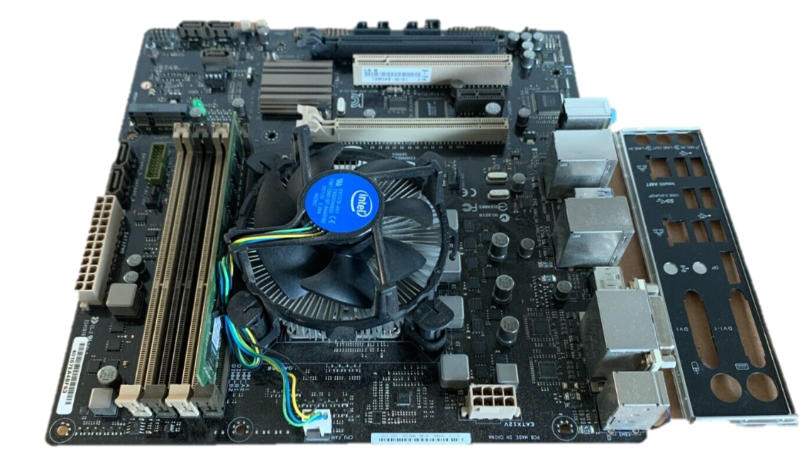
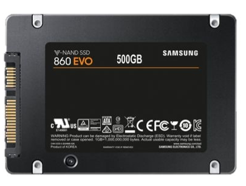
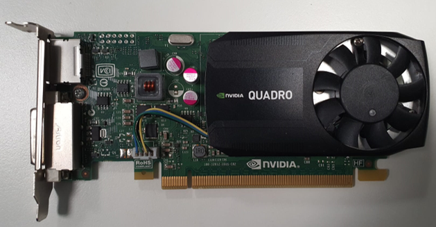
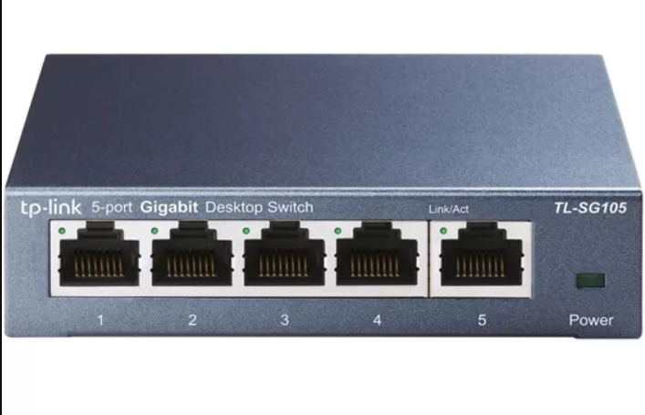

# HARDWARE Components

Below are the specifications of the components utilized in this project: 

- [HARDWARE Components](#hardware-components)
  - [ASUS CS-B](#asus-cs-b)
  - [SAMSUNG v-NAND SSD 860 EVO](#samsung-v-nand-ssd-860-evo)
  - [NVIDIA QUADRO](#nvidia-quadro)
  - [TP-Link Switch - TL-SG105](#tp-link-switch---tl-sg105)
  - [External Fans](#external-fans)
- [References](#references)

## ASUS CS-B
    

* CPU: Intel 4TH Generation Core Core i5 
  
* RAM: 2 x 8 GB DDR3 (4 Slots Available)  
 
* Internal USB: 8 x USB 2.0, 4 x USB 3.0  
  
* Intel I217LM, /Realtek 8111G, 1 x Gigabit LAN Controller

* Realtek ALC887-VD 8-Channel High Definition Audio CODEC

* Heat Sink Fan, 128 Mb Flash ROM, AMI BIOS, PnP, DMI2.0, WfM2.0, SM BIOS 2.5, ACPI 2.0a,

## SAMSUNG v-NAND SSD 860 EVO

* Capacity:	500 GB

* Core Count:	Triple-Core

* Frequency:	1,000 MHz

* Sequential Read:	550 MB/s

* Sequential Write:	520 MB/s
 
* Random Read:	98,000 IOPS

* Random Write:	90,000 IOPS

## NVIDIA QUADRO

* GPU Memory 2 GB DDR3

* Memory Interface 128-bit

* Memory Bandwidth 29.0 GB/s

* NVIDIA CUDA® Cores 384

* Thermal Solution Ultra-Quiet Active 
Fansink

* Graphics APIs Shader Model 5.0, OpenGL 4.53, DirectX 11.24, Vulkan 1.03
* 
## TP-Link Switch - TL-SG105

*  5 x 10/100/1000Mbps ports

* Compact design with Energy efficient Technology.

* Power Down Idle Ports

* Power Budget According to Cable Length : shorter cables would use less power because of less power degradation over their length

* Easy to use and save up to 84% of the power consumption
  
## External Fans

#  References
TP-Link Switch - TL-SG105: https://groceries.asda.com/product/mobile-phone-accessories/tp-link-5-port-gigabit-ethernet-switch-tl-sg-105/1000144744779

ASUS CS-B: https://basitcomputers.com/product/i5-4590-4th-gen-motherboard-processor-asus-q87-cs-b/

SAMSUNG v-NAND SSD 860 EVOL: https://www.techpowerup.com/ssd-specs/samsung-860-evo-500-gb.d7
