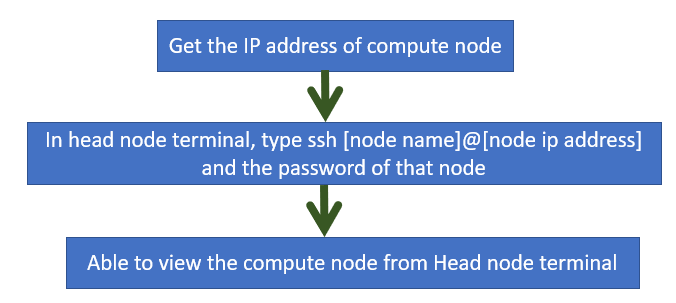

# Open-SSH Server Configuration
This file contains step by step guide to configure OpenSSH server in a ubuntu environment.

## Prerequisites:
Ensure that Ethernet connections are properly established across all nodes and that all ports are correctly configured.

## STEP 1: Installing Open-ssh Server in Head Node
Initially, input the command below to update all repositories in the Linux operating system.

                    sudo apt update

Next, execute the "install openssh-server" command to install all the required components. Respond with `yes` to all system prompts to ensure the successful installation of OpenSSH.

                    sudo apt install openssh-server

In most cases, the SSH server is already enabled. However, to confirm, enable the SSH service:

                    sudo systemctl enable ssh

Then, using the command provided below, verify the status of openSSH server. It will show if the ssh is active and loaded.

                    sudo systemctl status ssh     

Finally, SSH traffic should be allowed in the firewall and following command can be used to allow incomming SSH connection:

                    sudo ufw allow ssh

## STEP 2: Installing Open-ssh Server in Compute Nodes
The same steps used for configuring the OpenSSH server on the head node can be replicated on all compute nodes.

## STEP 3: Accessing compute nodes using Open-SSH connection

 
<b>Figure 1: Viewing the compute node from head node, using SSH</b>
  

## Step 4 : Setting up Passwordless SSH Login System

To establish a passwordless login system, begin by generating an SSH key pair on the head node using the command:

        ssh-keygen -t rsa 

Press `enter` to all the system prompts, which will generate the SSH key pair inside the .ssh directory in the home directory. Two keys will be created: 'id_rsa' and 'id_rsa.pub'.

The public key, denoted by `.pub`, must be copied to all other compute nodes using the following command:

        ssh-copy-id compute_node_username@ip_address

Once this step is completed, the passwordless login system will be established.