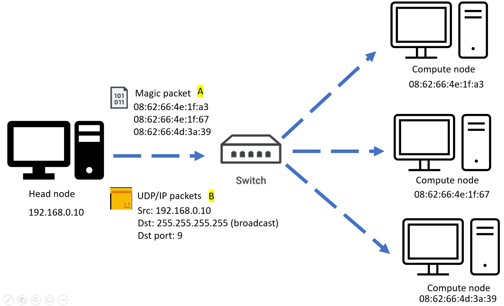
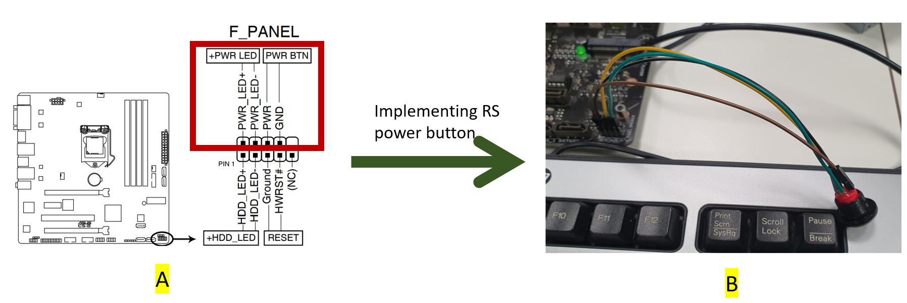
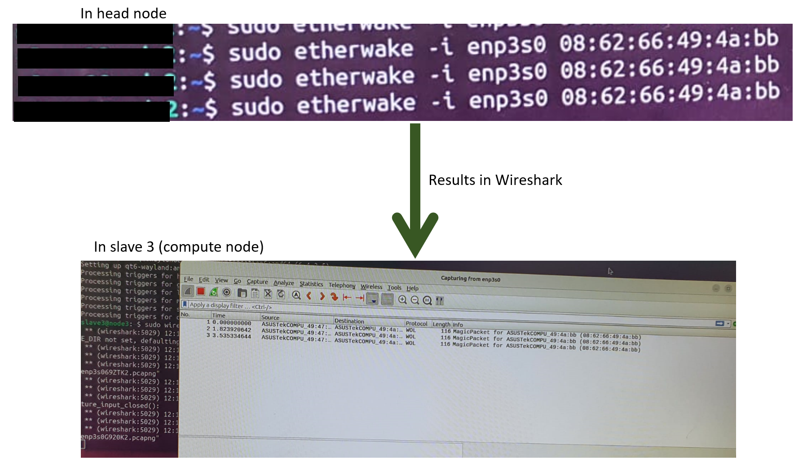

# **Power on and off function for HPC**
## **1. Implementation of power on and off function**

### **1.1 Background of Wake-On-LAN**
---
 
<b>Figure 1: Wake On LAN working setup</b>
 

A network protocol known as Wake-On-LAN (WoL) enables a computer to be remotely powered on or awakened from a low-power state over a network connection. This technology allows for remote maintenance, updates and power control, making it very helpful for maintaining computer networks in places like offices and data centers. In this project, using Wake-On-LAN, a magic packet containing the etherwake command (instructing the compute nodes to turn on) along with the appropriate compute nodes' MAC addresses (connecting with the data bridge) will be sent. This enables the compute nodes to power on from the low-power state. A demonstration of it is shown in Figure 1.

As shown in Figure 1A, the magic packet will contain all the MAC addresses of the compute nodes in the network. Note, that all devices must be on the same network, which is 192.168.0.0, and have a valid NIC (Network Interface Card). Then, the magic packets will be broadcast in the network as shown in Figure 1B, which is 255.255.255.255. The magic packets will be sent to the relevant compute nodes by identifying each MAC address incorporated within the magic packets.

### **1.2 Setting up Power button on head node**
---

 
<b>Figure 2: Implementing Power On and Off button on Head node motherboard</b>
 

As shown in Figure 2, must first identify the power button headers. As illustrated in part A, it was found that the front panel connectors are the connections to the power button and the power button's LED. Then, as shown in Figure 2 B, upon connecting the power button to the appropriate headers, the LED of the power button illuminates. After shutting down the system and turning it on using the power button, the head node successfully powers on. Furthermore, by pressing the power button after the head node is on, the head node displays a power-off option on the monitor. Through this process, the power on and off functionality was successfully implemented in the head node.

### **1.3 Setting up Wake-On-LAN magic packets communication**
---
 

 
<b>Figure 3: Implementing Wake-On-LAN between a head node and a compute node</b>
 

Following the letters and numbers on the above picture, below going to discuss the purpose of each line.

A. First, in the compute node BIOS, in the APM section related with power management, have to enable only the PCI-E/PCI, to enable Wake On LAN. It makes the compute node turn on when getting Wake on LAN magic packets only. Set the Restore AC Power LOSS to Power Off state.
1. To get the MAC address of compute node, which is a unique ID for the compute network interface.
2. To check the Wake-On-LAN state in the specific network interface. In initial, it will be d means disabled. Have to turn it on.
3. Here, making the Wake ON LAN activate by entering g at the end of the command.
4. However, after a reboot the WOL state will turn to d (disable). Therefore, have to make it persistent. In nm-connection-editor, by clicking magic, it will be persistent forever.
5. Reboot the compute node.
6. Verify whether the WOL is g or d state. It will be g, saying active state.
7. Install wireshark, which is a packet analyser. It will help to capture the incoming magic packets from compute node. Need only for testing purpose.
8. Install etherwake, to send Wake-On-LAN magic packets to compute node.
9. Sending a WOL magic packets to compute node, by specifying it’s network interface and MAC address.
10. Simultaneously, check whether the compute node receiving those packets by using wireshark GUI.
By following, the above steps successfully, can setup a Wake-On-LAN communication. 

### **1.4 Bash scripting for Wake-On-LAN**
---
After, setting up the WOL communication and Open-SSH, have to create a bash script to turn on and off the compute nodes, which performs after booting up of head node. This step took due to the failure of power on and off button process. 

    #! /usr/bin/env bash

    #define MAC address in array for etherwake function
    declare -a WakeUpMacs = (“08:62:66:49:4a:b7” “08:62:66:4e:1f:a3” “08:62:66:4e:1f:67” “08:62:66:4d:3a:e9”)

    #define ssh with IP address in array for power off function
    declare -a shutDownHosts = (“slave1@192.168.0.11” “slave2@192.168.0.12” “slave3@192.168.0.13” “slave4@192.168.0.14”)

    if  [“$1” = “-on”]; then
        #wake-up commands
        for mac in “${WakeUpMacs[@]}” ; do
            sudo etherwake -i enp3s0 “$mac”
        done
    elif [“$1” = “-off”]; then
        #shutdown commands
        for host in “${shutDownHosts[@]}”; do
            ssh “$host” ‘sudo shutdown now’
        done 
    else
        echo “Usage: $0 -on | -off” 
    fi

<b>Figure 4: Bash script to power on and off compute nodes</b>
 

As shown in Figure 4 above, a bash script was created to turn off and on the compute nodes. As illustrated in the bash script, the MAC addresses of the compute nodes and the SSH with IP addresses were stored in an array. Next, to turn on the compute nodes, the etherwake function was used within a for loop, and to turn off the compute nodes, sudo shutdown with appropriate SSH was used within a for loop. Finally, to detect any inappropriate input, an echo message was created to instruct on the correct input format.

## **2. Testing power on and off function**

After the successful implementation of Wake On LAN, 3 tests have been conducted:

### **2.1. Wireshark testing**
---

 
<b>Figure 5: Wireshark testing</b>
 
<ul>
<li>Purpose: To verify that WoL magic packets are correctly formatted and successfully transmitted over the network to wake up targeted devices from a low-power state.</li>

<li>Method: Network traffic is captured and analysed using Wireshark during the attempt to wake a device using WoL. This involves sending a magic packet containing the target device's MAC address over the network and monitoring for its transmission and receipt. (shown in Figure 5)</li>

<li>Results: As shown in Figure 5, the testing confirms the magic packet reaches the intended device and is properly constructed, indicating the built network configurations support WoL functionality. Similary, the above test has conducted across all compute nodes with head node. </li>
</ul>

### **2.2. Bash script power on testing**
---
<ul>
<li>Purpose: To verify whether the created bash script turns on the compute nodes from the head node.</li>

<li>Method: After the head node successfully boots up, the script name and the appropriate “-on” command have to be entered.</li>

<li>Results: As a result, the head node will not print anything in the terminal. The compute nodes start to turn on one by one as mentioned in the script's for loop.</li>
</ul>

### **2.3. Bash script power off testing**
---
<ul>
<li>Purpose: To verify whether the created bash script turns off the compute nodes.</li>

<li>Method: After successful power-on testing of the compute nodes, a power-off test is conducted. For that, similarly, enter the script’s name followed by the “-off” command.</li>

<li>Results: As a result, the head node will not print anything in the terminal. The compute nodes begin to turn off one by one as mentioned in the script's for loop.</li>
</ul>

 ## **3. Helpful Resources**

1. How to install WOL : https://pimylifeup.com/ubuntu-enable-wake-on-lan/#:~:text=Wake%2Don%2DLAN%20is%20a,functionality%20through%20your%20devices%20BIOS.
 

2. The button can be find here: https://uk.rs-online.com/web/p/push-button-switches/2099127?cm_mmc=UK-PLA-DS3A-_-google-_-CSS_UK_EN_PMAX_RS+PRO-_--_-2099127&matchtype=&&gad_source=1 gclid=EAIaIQobChMIpP3xg7-mhAMVFAUGAB0t5QD5EAQYByABEgIy1_D_BwE&gclsrc=aw.ds
 

3. Power button and Front panel connections : https://www.pcinq.com/how-to-connect-motherboard-front-panel-headers/ https://www.electronicshub.org/power-button-on-motherboard/#:~:text=Ans%3A%20The%20power%20switch%20on,for%20the%2020-pin%20header
 

 ## **5. Images**
 
<b>Figure 6: Push button used in head node</b>
 
